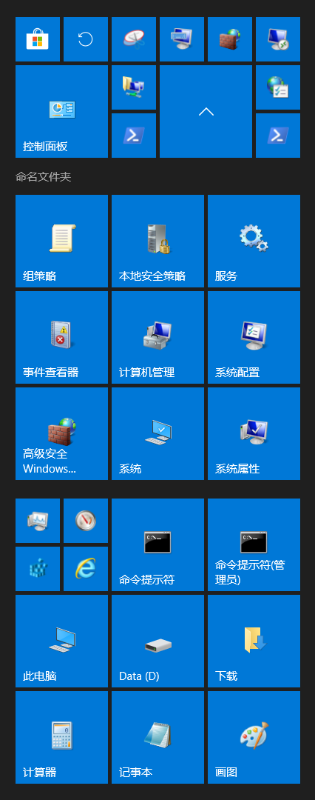

# ZL-Z2-WIN10系统安装记录

## 准备

### 基本环境

* 笔记本: 机械革命 Z2 商务版
* 辅助安装环境: Arch Linux, qemu, libvirt, virt-manager，samba 共享
* SSD: BC501 NVMe SK hynix 256GB

### 清空硬盘

```
blkdiscard /dev/nvme1n1
nvme id-ctrl -H /dev/nvme1
nvme format /dev/nvme1 --ses=1 -n 1
poweroff # then power on
blkdiscard /dev/nvme1n1
```

### 硬盘分区

写入分区表：`dd if=/data/Z2SK250.WIN10.sectors of=/dev/nvme1n1 bs=512`（[Z2SK250.WIN10.sectors](Z2SK250.WIN10.sectors)）。

在分区管理器中创建然后删除一个分区，来修复[第二GPT](https://zh.wikipedia.org/wiki/GUID%E7%A3%81%E7%A2%9F%E5%88%86%E5%89%B2%E8%A1%A8)。

分区情况：
```
[root@ZL-Z2-HOST zl]# fdisk -o Device,Start,End,Sectors,Size,Type,Type-UUID,Attrs,Name,UUID -l /dev/nvme1n1
Disk /dev/nvme1n1：238.49 GiB，256060514304 字节，500118192 个扇区
磁盘型号：BC501 NVMe SK hynix 256GB               
单元：扇区 / 1 * 512 = 512 字节
扇区大小(逻辑/物理)：512 字节 / 512 字节
I/O 大小(最小/最佳)：512 字节 / 512 字节
磁盘标签类型：gpt
磁盘标识符：52AE126A-7977-2D4D-AADE-50CFB208E72F

设备                起点      末尾      扇区   大小 类型               类型-UUID                            属性                      名称                         UUID
/dev/nvme1n1p1      2048  10520575  10518528     5G EFI 系统           C12A7328-F81F-11D2-BA4B-00A0C93EC93B GUID:63                   EFI system partition         CB7F67C7-4BE8-49B7-A613-4141DEB837EA
/dev/nvme1n1p2  10522624  10784767    262144   128M Microsoft 保留     E3C9E316-0B5C-4DB8-817D-F92DF00215AE GUID:63                   Microsoft reserved partition 22B18734-3563-4753-A70D-417AAB5DDFD7
/dev/nvme1n1p3  10786816 346462207 335675392 160.1G Microsoft 基本数据 EBD0A0A2-B9E5-4433-87C0-68B6B72699C7                           Basic data partition         9694778E-9015-49BF-9296-F6BDC790D3FD
/dev/nvme1n1p4 346464256 348577791   2113536     1G Windows 恢复环境   DE94BBA4-06D1-4D40-A16A-BFD50179D6AC RequiredPartition GUID:63 Microsoft recovery partition D918F60E-1D6A-4B63-A2EF-CD8071CC6CDF
/dev/nvme1n1p5 348579840 499705855 151126016  72.1G Microsoft 基本数据 EBD0A0A2-B9E5-4433-87C0-68B6B72699C7                           Basic data partition         8B122E7F-E3D6-4F7F-BCA9-B7159FBB947B

```

### 虚拟机配置

* 安装初期采用最简配置：[ZLZD-mini.xml](ZLZD-mini.xml)
* 安装驱动前会切换到完整配置：[ZLZD.xml](ZLZD.xml)

```
virsh define /data/shared/ZLZD-mini.xml
```

## Windows 安装

### 用安装盘启动安装

准备安装光盘镜像文件：

|名称|cn_windows_10_enterprise_ltsc_2019_x64_dvd_9c09ff24.iso
|:--|:--
|大小|4478906368 字节 (4271 MiB)
|CRC32|0C3357E3
|SHA1|24B59706D5EDED392423936C82BA5A83596B50CC
|SHA256|AA4EA00581AA84999DBFE0627499B392E10C75912D6E2F1635EB7C4B9139FB5F

virt-manager中插入光盘镜像，设置引导选项为光盘引导，开机，期间注意按任意键从光盘启动。

进入 PE 系统后，用 diskpart 分配盘符，然后用资源管理器格式化。格式化信息：

|盘符|文件系统|标签
|:--|:--|:--
|P:|FAT32|ESP
|C:|NTFS|Win10
|R:|NTFS|WinRE
|D:|NTFS|Data

然后进入 Windows 安装程序正常安装。

### 重启后的安装操作

重启后不人工操作，会进入 OVMF 的 EFI Shell 环境。输入`reset -s`关机。

在 virt-manager 中移除光驱和网卡设备，检查引导选项为硬盘引导，开机。

按安装向导默认设置安装，除了以下设置：
* **用户名**：ZL
* **联网**：不联网
* **发送活动历史记录**：否
* **隐私设置**：仅开启“查找我的设备”和“位置”

进入桌面后，找到 cmd.exe，输入`shutdown /s /t 0`关机。

### 备份系统

执行`virsh define /data/shared/ZLZD-mini.xml`恢复光驱和网卡。

virt-manager 中重新放入 Windows 安装光盘，从光盘启动开机。

在 PE 系统中输入以下命令备份：
```
wpeutil InitializeNetwork
net use V: \\ZL-Z2-HOST\data

diskpart

dism /Capture-Image /ImageFile:V:\shared\Win10-01-OSInstalled-ESP.wim /CaptureDir:P:\ /Name:Win10OS-ESP /Compress:max /CheckIntegrity /Verify /EA
dism /Capture-Image /ImageFile:V:\shared\Win10-01-OSInstalled-WinRE.wim /CaptureDir:R:\ /Name:Win10OS-WinRE /Compress:max /CheckIntegrity /Verify /EA
dism /Capture-Image /ImageFile:V:\shared\Win10-01-OSInstalled.wim /CaptureDir:C:\ /Name:Win10OS /Compress:max /CheckIntegrity /Verify /EA
```

下一步仍然需要 PE 环境，所以不要关机。

改进思路：

1. 在设置用户名等之前备份（但注意此时 WinRE 分区可能还没有内容）
1. 备份前将此安装记录放在桌面

## 第一轮系统设置

### 安装 Windows 应用商店 APP

准备好从 Windows 10 1809 安装光盘镜像提取的 Windows Store 文件：[winstore_84ac403f.wim](winstore_84ac403f.wim)。

在 PE 系统中用这个命令导入 C 盘：`dism /Apply-Image /ImageFile:V:\shared\winstore_84ac403f.wim /ApplyDir:C:\ /Index:1 /CheckIntegrity /Verify /EA`。

将下一步需要的命令复制到 D 盘。
然后关机，删除光驱设备（保留网卡设备），从硬盘启动。

进入桌面后，以管理员身份打开 PowerShell，执行以下命令：
```
Add-AppXPackage -Register 'C:\Program Files\WindowsApps\Microsoft.VCLibs.140.00_14.0.25426.0_x64__8wekyb3d8bbwe\AppXManifest.xml' -DisableDevelopmentMode
Add-AppXPackage -Register 'C:\Program Files\WindowsApps\Microsoft.VCLibs.140.00_14.0.25426.0_x86__8wekyb3d8bbwe\AppXManifest.xml' -DisableDevelopmentMode

Add-AppXPackage -Register 'C:\Program Files\WindowsApps\Microsoft.NET.Native.Runtime.1.6_1.6.24903.0_x64__8wekyb3d8bbwe\AppXManifest.xml' -DisableDevelopmentMode
Add-AppXPackage -Register 'C:\Program Files\WindowsApps\Microsoft.NET.Native.Runtime.1.6_1.6.24903.0_x86__8wekyb3d8bbwe\AppXManifest.xml' -DisableDevelopmentMode
Add-AppXPackage -Register 'C:\Program Files\WindowsApps\Microsoft.NET.Native.Runtime.1.7_1.7.25531.0_x64__8wekyb3d8bbwe\AppXManifest.xml' -DisableDevelopmentMode
Add-AppXPackage -Register 'C:\Program Files\WindowsApps\Microsoft.NET.Native.Runtime.1.7_1.7.25531.0_x86__8wekyb3d8bbwe\AppXManifest.xml' -DisableDevelopmentMode

Add-AppXPackage -Register 'C:\Program Files\WindowsApps\Microsoft.NET.Native.Framework.1.6_1.6.24903.0_x64__8wekyb3d8bbwe\AppXManifest.xml' -DisableDevelopmentMode
Add-AppXPackage -Register 'C:\Program Files\WindowsApps\Microsoft.NET.Native.Framework.1.6_1.6.24903.0_x86__8wekyb3d8bbwe\AppXManifest.xml' -DisableDevelopmentMode
Add-AppXPackage -Register 'C:\Program Files\WindowsApps\Microsoft.NET.Native.Framework.1.7_1.7.25531.0_x64__8wekyb3d8bbwe\AppXManifest.xml' -DisableDevelopmentMode
Add-AppXPackage -Register 'C:\Program Files\WindowsApps\Microsoft.NET.Native.Framework.1.7_1.7.25531.0_x86__8wekyb3d8bbwe\AppXManifest.xml' -DisableDevelopmentMode

Add-AppXPackage -Register 'C:\Program Files\WindowsApps\Microsoft.Advertising.Xaml_10.1804.2.0_x64__8wekyb3d8bbwe\AppXManifest.xml' -DisableDevelopmentMode
Add-AppXPackage -Register 'C:\Program Files\WindowsApps\Microsoft.Advertising.Xaml_10.1804.2.0_x86__8wekyb3d8bbwe\AppXManifest.xml' -DisableDevelopmentMode

Add-AppXPackage -Register 'C:\Program Files\WindowsApps\Microsoft.WindowsStore_11805.1001.49.0_x64__8wekyb3d8bbwe\AppXManifest.xml' -DisableDevelopmentMode
Add-AppXPackage -Register 'C:\Program Files\WindowsApps\Microsoft.WindowsStore_11805.1001.49.0_neutral_split.language-zh-hans_8wekyb3d8bbwe\AppXManifest.xml' -DisableDevelopmentMode
Add-AppXPackage -Register 'C:\Program Files\WindowsApps\Microsoft.WindowsStore_11805.1001.49.0_neutral_split.scale-100_8wekyb3d8bbwe\AppXManifest.xml' -DisableDevelopmentMode
Add-AppXPackage -Register 'C:\Program Files\WindowsApps\Microsoft.WindowsStore_11805.1001.49.0_neutral_split.scale-125_8wekyb3d8bbwe\AppXManifest.xml' -DisableDevelopmentMode
#Add-AppXPackage -Register 'C:\Program Files\WindowsApps\Microsoft.WindowsStore_11805.1001.4913.0_neutral_~_8wekyb3d8bbwe\AppXManifest.xml' -DisableDevelopmentMode

Add-AppXPackage -Register 'C:\Program Files\WindowsApps\Microsoft.StorePurchaseApp_11805.1001.8.0_x64__8wekyb3d8bbwe\AppXManifest.xml' -DisableDevelopmentMode
Add-AppXPackage -Register 'C:\Program Files\WindowsApps\Microsoft.StorePurchaseApp_11805.1001.8.0_neutral_split.language-zh-hans_8wekyb3d8bbwe\AppXManifest.xml' -DisableDevelopmentMode
Add-AppXPackage -Register 'C:\Program Files\WindowsApps\Microsoft.StorePurchaseApp_11805.1001.8.0_neutral_split.scale-100_8wekyb3d8bbwe\AppXManifest.xml' -DisableDevelopmentMode
#Add-AppXPackage -Register 'C:\Program Files\WindowsApps\Microsoft.StorePurchaseApp_11805.1001.813.0_neutral_~_8wekyb3d8bbwe\AppXManifest.xml' -DisableDevelopmentMode

```

然后在开始菜单中打开 Microsoft Store，让它升级自己。

### 其他设置

更改硬件时钟为 UTC：
打开注册表编辑器，找到`HKEY_LOCAL_MACHINE\System\CurrentControlSet\Control\TimeZoneInformation`，新建 DWORD 项，名字为`RealTimeIsUniversal`，值为1。

在 Windows 设置中更改计算机名为`ZL-Z2-WIN10`。

重启检查是否生效。

### 语言包

在 Windows 设置中添加英语语言包。

安装中文和英语的“本地体验包”。

### 更新系统

在 Windows 设置中更新系统。反复检查到没有更新为止。

### 磁盘清理

重启，清理磁盘。
然后`shutdown /s /t 0`关机。

### 备份

`virsh define`命令加载`ZLZD-mini.xml`虚拟机配置文件。
启动进入 PE 系统。
将此文件放在桌面。
然后按前面的方法备份系统，备份命令为：
```
dism /Capture-Image /ImageFile:V:\shared\Win10-02-Settings1.wim /CaptureDir:C:\ /Name:Win10S1 /Compress:max /CheckIntegrity /Verify /EA
```

## 驱动程序及第二轮系统设置

### Windows Update 设置

启动系统，virt-manager 中断开网卡连接。

组策略 - 计算机配置 - 管理模板 - 系统 - 设备安装：
* **指定设备驱动程序源位置的搜索顺序**：不搜索 Windows 更新

组策略 - 计算机配置 - 管理模板 - Windows 组件 - Windows 更新：
* **配置自动更新**：2-通知下载和自动安装；安装其他 Microsoft 产品的更新
* **Windows 更新不包括驱动程序**：已启用
* **启用软件通知**：已启用
* **启用通过自动更新建议的更新**：已启用

重启系统，virt-manager 中恢复网卡连接。

### 激活 Windows

管理员身份运行：
```
slmgr /skms [<ipv6addr>]
slmgr /ato
slmgr /ckms
```

### 启用 Windows 功能

控制面板：
* .net 3.5
* Hyper-V 管理工具
* NFS 服务（及所有子功能）
* Telnet Client
* TFTP Client

设置：
* XPS 查看器
* OpenSSH 服务器

### exec-as-admin

编译[exec-as-admin](https://github.com/zwhfly/exec-as-admin)，得到[exec-as-admin.exe](exec-as-admin.exe)，放在路径`C:\Programs\exec-as-admin\exec-as-admin.exe`。

### 杂项

* 使用小任务栏按钮
* 右键开始菜单不使用 Powershell
* 合并任务栏按钮：任务栏已满时
* 托盘图标：任务管理器，安全删除硬件
* 文件资源管理器工具栏展开
* 显示扩展名
* 任务管理器显示详细信息、逻辑处理器使用率、选择列
* 睡眠时间，电池：30 分钟、电源：从不
* 启用休眠
* 125% 缩放，修复模糊
* 打开剪切板历史记录
* 自动播放：每次都询问
* 关闭代理自动检测
* 开始菜单“显示最常用的应用”
* 输入法默认英文；取消 Shift 中英切换
* 防火墙高级设置：入站规则，启用回显请求
* 计算器切换到“科学型”模式
* IE 使用推荐设置，主页设置为`about:Tabs`
* WMP 使用推荐设置

### 开始菜单磁贴

#### 按下图组织开始菜单磁贴:



#### 创建过程

创建文件夹`C:\Users\ZL\AppData\Roaming\Microsoft\Windows\Start Menu\MyStartMenu`。

快捷方式：
* **Microsoft Store**：开始菜单 -> Microsoft Store
* **Windows 更新**：“设置” App -> 更新和安全 -> Windows 更新
* **截图工具**：开始菜单 -> Windows 附件 -> 截图工具
* **屏幕键盘**：开始菜单 -> Windows 轻松使用 -> 屏幕键盘
* **开关防火墙**：在 MyStartMenu 中创建快捷方式`%SystemRoot%\System32\control.exe /name Microsoft.WindowsFirewall /page pageConfigureSettings`，图标在`%SystemRoot%\System32\FirewallControlPanel.dll`
* **远程桌面连接**：开始菜单 -> Windows 附件 -> 远程桌面连接
* **控制面板**：开始菜单 -> Windows 系统 -> 控制面板
* **网络连接**：在 MyStartMenu 中创建快捷方式`%SystemRoot%\System32\control.exe %SystemRoot%\System32\ncpa.cpl`，图标在 cpl 文件中
* **Internet 属性**：在 MyStartMenu 中创建快捷方式`%SystemRoot%\System32\control.exe %SystemRoot%\System32\inetcpl.cpl,,4`，图标在 cpl 文件中
* **组策略**：在 MyStartMenu 中创建快捷方式`%SystemRoot%\System32\gpedit.msc`
* **本地安全策略**：开始菜单 -> Windows 管理工具 -> 本地安全策略
* **服务**：开始菜单 -> Windows 管理工具 -> 服务
* **事件查看器**：开始菜单 -> Windows 管理工具 -> 事件查看器
* **计算机管理**：开始菜单 -> Windows 管理工具 -> 计算机管理
* **系统配置**：开始菜单 -> Windows 管理工具 -> 系统配置
* **高级安全 Windows Defender 防火墙**：开始菜单 -> Windows 管理工具 -> 高级安全 Windows Defender 防火墙
* **系统**：控制面板 -> 系统和安全 -> 系统 -> 右键 -> 创建快捷方式 -> 移动到 MyStartMenu 中
* **系统属性**：在 MyStartMenu 中创建快捷方式`%SystemRoot%\System32\control.exe %SystemRoot%\System32\sysdm.cpl`，图标在 cpl 文件中
* **Windows PowerShell**：开始菜单 -> Windows PowerShell -> Windows PowerShell
* **PowerShell(管理员)**：在 MyStartMenu 中创建文件`powershell.admin.bat`，内容为`"C:\Programs\exec-as-admin\exec-as-admin.exe" powershell.exe -noexit -command Set-Location -Path C:\Users\ZL`，然后创建它的快捷方式，右键属性中配置运行方式为“最小化”，图标在`powershell.exe`文件中
* **任务管理器**：开始菜单 -> Windows 系统 -> 任务管理器
* **资源监视器**：开始菜单 -> Windows 管理工具 -> 资源监视器
* **注册表编辑器**：开始菜单 -> Windows 管理工具 -> 注册表编辑器
* **Internet Explorer**：开始菜单 -> Windows 附件 -> Internet Explorer
* **命令提示符**：开始菜单 -> Windows 系统 -> 命令提示符
* **命令提示符(管理员)**：在 MyStartMenu 中创建文件`cmd.admin.bat`，内容为`"C:\Programs\exec-as-admin\exec-as-admin.exe" cmd.exe /k "title 命令提示符 & pushd C:\Users\ZL"`，然后创建它的快捷方式，右键属性中配置运行方式为“最小化”，图标在`cmd.exe`文件中
* **此电脑**：开始菜单 -> Windows 系统 -> 此电脑
* **Data (D)**：在 MyStartMenu 中创建快捷方式`D:\`
* **下载**：在 MyStartMenu 中创建快捷方式`C:\Users\ZL\Downloads`
* **计算器**：开始菜单 -> Windows 附件 -> 计算器
* **记事本**：开始菜单 -> Windows 附件 -> 记事本
* **画图**：开始菜单 -> Windows 附件 -> 画图
* **完全关机**：在 MyStartMenu 中创建快捷方式`%SystemRoot%\System32\shutdown.exe /s /t 0`，所用图标在`SHELL32.dll`中

### 启用 Windows 照片查看器

将下面的文本保存为`photoviewer.reg`文件并导入注册表：
```
Windows Registry Editor Version 5.00

[HKEY_CLASSES_ROOT\Applications\photoviewer.dll\shell\open]
"MuiVerb"="@photoviewer.dll,-3043"

[HKEY_CLASSES_ROOT\Applications\photoviewer.dll\shell\open\command]
@=hex(2):25,00,53,00,79,00,73,00,74,00,65,00,6d,00,52,00,6f,00,6f,00,74,00,25,\
  00,5c,00,53,00,79,00,73,00,74,00,65,00,6d,00,33,00,32,00,5c,00,72,00,75,00,\
  6e,00,64,00,6c,00,6c,00,33,00,32,00,2e,00,65,00,78,00,65,00,20,00,22,00,25,\
  00,50,00,72,00,6f,00,67,00,72,00,61,00,6d,00,46,00,69,00,6c,00,65,00,73,00,\
  25,00,5c,00,57,00,69,00,6e,00,64,00,6f,00,77,00,73,00,20,00,50,00,68,00,6f,\
  00,74,00,6f,00,20,00,56,00,69,00,65,00,77,00,65,00,72,00,5c,00,50,00,68,00,\
  6f,00,74,00,6f,00,56,00,69,00,65,00,77,00,65,00,72,00,2e,00,64,00,6c,00,6c,\
  00,22,00,2c,00,20,00,49,00,6d,00,61,00,67,00,65,00,56,00,69,00,65,00,77,00,\
  5f,00,46,00,75,00,6c,00,6c,00,73,00,63,00,72,00,65,00,65,00,6e,00,20,00,25,\
  00,31,00,00,00

[HKEY_CLASSES_ROOT\Applications\photoviewer.dll\shell\open\DropTarget]
"Clsid"="{FFE2A43C-56B9-4bf5-9A79-CC6D4285608A}"

[HKEY_LOCAL_MACHINE\SOFTWARE\Microsoft\Windows Photo Viewer\Capabilities\FileAssociations]
".jpg"="PhotoViewer.FileAssoc.Jpeg"
".wdp"="PhotoViewer.FileAssoc.Wdp"
".jfif"="PhotoViewer.FileAssoc.JFIF"
".dib"="PhotoViewer.FileAssoc.Bitmap"
".png"="PhotoViewer.FileAssoc.Png"
".tiff"="PhotoViewer.FileAssoc.Tiff"
".bmp"="PhotoViewer.FileAssoc.Bitmap"
".jpe"="PhotoViewer.FileAssoc.Jpeg"
".jpeg"="PhotoViewer.FileAssoc.Jpeg"
".gif"="PhotoViewer.FileAssoc.Gif"
".tif"="PhotoViewer.FileAssoc.Tiff"
```

* 创建以上格式的文件并选择始终使用 Windows 照片查看器打开
* 创建`.ico`格式的文件并选择始终使用 Windows 照片查看器打开
* 创建`.gif`格式的文件并选择始终使用 Internet Explorer 打开

### 文件资源管理器右键菜单转到命令提示符

将这段代码保存为`goto-cmd.reg`并导入到注册表：
```
Windows Registry Editor Version 5.00

[HKEY_CLASSES_ROOT\Directory\background\shell\goto-cmd]
@="-> cmd.exe"

[HKEY_CLASSES_ROOT\Directory\background\shell\goto-cmd\command]
@="cmd.exe /k pushd \"%V\" & title 命令提示符"

[HKEY_CLASSES_ROOT\Directory\background\shell\goto-cmd-admin]
@="-> cmd.exe (Administrator)"

[HKEY_CLASSES_ROOT\Directory\background\shell\goto-cmd-admin\command]
@="\"C:\\Programs\\exec-as-admin\\exec-as-admin.exe\" cmd.exe /k pushd \"%V\" & title 命令提示符"

[HKEY_CLASSES_ROOT\Directory\shell\goto-cmd]
@="-> cmd.exe"

[HKEY_CLASSES_ROOT\Directory\shell\goto-cmd\command]
@="cmd.exe /k pushd \"%V\" & title 命令提示符"

[HKEY_CLASSES_ROOT\Directory\shell\goto-cmd-admin]
@="-> cmd.exe (Administrator)"

[HKEY_CLASSES_ROOT\Directory\shell\goto-cmd-admin\command]
@="\"C:\\Programs\\exec-as-admin\\exec-as-admin.exe\" cmd.exe /k pushd \"%V\" & title 命令提示符"

[HKEY_CLASSES_ROOT\Drive\shell\goto-cmd]
@="-> cmd.exe"

[HKEY_CLASSES_ROOT\Drive\shell\goto-cmd\command]
@="cmd.exe /k pushd \"%V\" & title 命令提示符"

[HKEY_CLASSES_ROOT\Drive\shell\goto-cmd-admin]
@="-> cmd.exe (Administrator)"

[HKEY_CLASSES_ROOT\Drive\shell\goto-cmd-admin\command]
@="\"C:\\Programs\\exec-as-admin\\exec-as-admin.exe\" cmd.exe /k pushd \"%V\" & title 命令提示符"

```

### Z2 驱动

* IntelChipset-HM370-intel.com-10.1.18-201911.zip
* IntelGraphics-8750H-intel.com-26.20.100.7755-202001.zip
* NvidiaVideo-1050Mobile-nvidia.com-442.19-202001-notebook-win10-64bit-international-dch-whql.exe
* IntelWiFi-AC9462-intel.com-21.60.2.1-201912-Win10x64.exe
* RealtekGbE-8168-realtek.com-10.038.1118.2019-201911-Install_Win10_10038_12202019.zip
* IntelBT-AC9462-intel.com-21.60.0.4-201912-Win10x64.zip
* RealtekAudio-UAD-Mechrevo-6.0.1.8428-201804.zip
* RealtekAudio-CreativeAudioEffectsComponent-MicrosoftCatalog-2.0.0.33-201902-01c279d6-63f6-456d-ae97-58eb8aad8571_735dbb94048705b3bf418d6c4c2bc00e8cc1a8aa.cab
* RealtekAudio-SoundBlasterConnect-MicrosoftCatalog-2.2.7.0-201902-24af12bc-5337-4c9d-ba6e-ed58b44d1d98_2893ee4790bb16f40c631855d5756cac7abcb018.cab
* IntelSerialIO-NUC8-intel.com-30.100.1915.1-201904.zip
* RealtekCardReader-0BDA0129-MicrosoftCatalog-10.0.18362.31255-201912-9f6111f9-3297-47a8-8ca3-5dc42897bad6_33bc07eb8e141f73627a0acb2ded5f50e7775024.cab
* IntelMEI-MEI-MicrosoftCatalog-1815.12.0.2021-201804-451de8b6-0274-4e77-becb-717c42774929_b0558e18ccc5bbea3a662a745d753ae7be049c80.cab
* ControlCenter

### QEMU 驱动

#### 驱动准备

改进方向：使用 RedHat 发布的 [virtio-win-gt-x64.msi](https://fedorapeople.org/groups/virt/virtio-win/direct-downloads/stable-virtio/virtio-win-gt-x64.msi) 安装包，但要解决：
* vioscsi 和 viostor 驱动卸载时不被删除
* 等下一个稳定版包含此安装包
* IVSHMEM 不含在内
* VDAgent 版本是否最新
* 使用`ZLZD-mini.xml`配置时 VDAgent 会安装失败，造成整个安装包失败

##### VirtIO Drivers

从[https://fedorapeople.org/groups/virt/virtio-win/direct-downloads/stable-virtio/virtio-win.iso](https://fedorapeople.org/groups/virt/virtio-win/direct-downloads/stable-virtio/virtio-win.iso)下载得到`virtio-win-0.1.171.iso`。

##### IVSHMEM

下载[https://fedorapeople.org/groups/virt/virtio-win/direct-downloads/upstream-virtio/virtio-win10-prewhql-0.1-161.zip](https://fedorapeople.org/groups/virt/virtio-win/direct-downloads/upstream-virtio/virtio-win10-prewhql-0.1-161.zip)。

##### Spice VDAgent Service

下载[https://www.spice-space.org/download/windows/vdagent/vdagent-win-0.10.0/vdagent-win-0.10.0-x64.zip](https://www.spice-space.org/download/windows/vdagent/vdagent-win-0.10.0/vdagent-win-0.10.0-x64.zip)。
提取得到文件`vdagent.exe`和`vdservice.exe`。

用 NSIS 脚本（[vdagent.nsi](vdagent.nsi)）制作安装程序：
```
makensis -DVERSION=0.10.0 vdagent.nsi
```

##### VirtIO Balloon Service

从`virtio-win-0.1.171.iso`中提取`blnsvr.exe`。

用 NSIS 脚本（[blnsvr.nsi](blnsvr.nsi)）制作安装程序：
```
makensis -DVERSION=100.77.104.17100 blnsvr.nsi
```

##### 制作驱动光盘镜像

将下列文件放入 QEMU-Win10x64 文件夹中：
* 提取 virtio-win-0.1.171.iso 中的文件，只保留 Win10 x64 相关的
* 提取 Win10 x64 的 ivshmem 驱动程序文件
* dpinst.exe
* SpiceVDAgent-0.10.0.exe
* VirtIOBalloonService-100.77.104.17100.exe

制作 ISO 镜像文件：
```
mkisofs -o QEMU-Drivers-Win10x64-0.1.171.iso -UDF -v QEMU-Win10x64/
```

存档：[QEMU-Drivers-Win10x64-0.1.171.iso.7z](QEMU-Drivers-Win10x64-0.1.171.iso.7z)。

#### 驱动安装

用`virsh define`命令导入`ZLZD-mini.xml`虚拟机配置文件。

virt-manager 中插入 virtio 驱动光盘镜像`QEMU-Drivers-Win10x64-0.1.171.iso`。
启动虚拟机。

以管理员身份打开命令行窗口，依次安装这些驱动：
```
"E:\dpinst.exe" /PATH E:\Balloon\w10\amd64
"E:\dpinst.exe" /PATH E:\NetKVM\w10\amd64
"E:\dpinst.exe" /PATH E:\pvpanic\w10\amd64
"E:\dpinst.exe" /PATH E:\qemufwcfg\w10\amd64
"E:\dpinst.exe" /PATH E:\qemupciserial\w10\amd64
"E:\dpinst.exe" /PATH E:\qxldod\w10\amd64
"E:\dpinst.exe" /PATH E:\smbus\2k8\amd64
"E:\dpinst.exe" /PATH E:\vioinput\w10\amd64
"E:\dpinst.exe" /PATH E:\viorng\w10\amd64
"E:\dpinst.exe" /PATH E:\vioscsi\w10\amd64
"E:\dpinst.exe" /PATH E:\vioserial\w10\amd64
"E:\dpinst.exe" /PATH E:\viostor\w10\amd64
"E:\dpinst.exe" /PATH E:\ivshmem
"E:\guest-agent\qemu-ga-x86_64.msi"
"E:\VirtIOBalloonService-100.77.104.17100.exe"
"E:\SpiceVDAgent-0.10.0.exe"
```

`shutdown`命令关机。
用`virsh define`命令加载`ZLZD.xml`虚拟机配置文件。修改硬盘的磁盘总线为SATA。
启动虚拟机。进入桌面后用`shutdown`命令关机。
用`virsh define`命令加载`ZLZD.xml`虚拟机配置文件。
启动虚拟机。检查安装情况。

### 更新、清理、备份

## 应用软件

TODO: cmd.exe 字体
